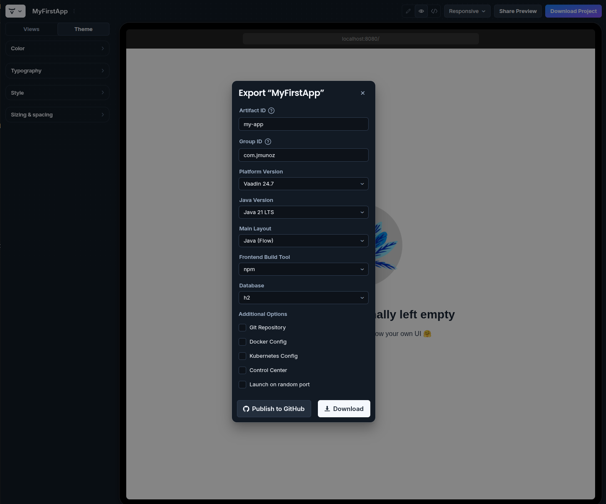
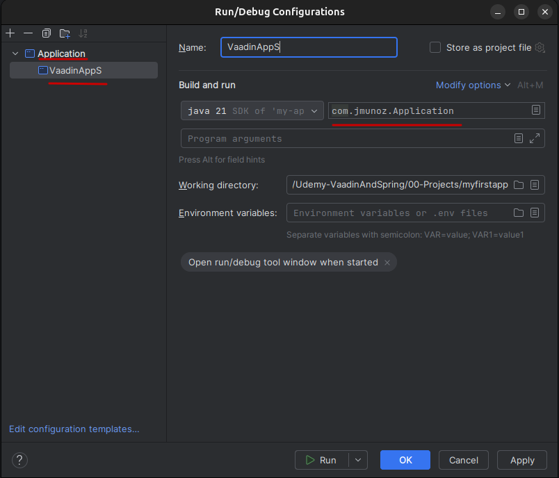
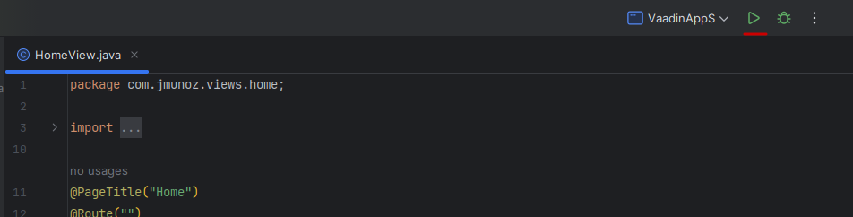
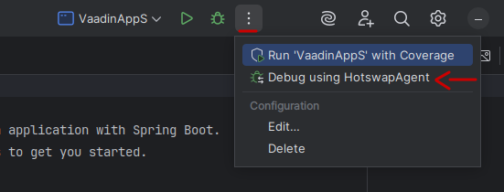

# VAADIN 24 & SPRING AI: BUILD NEXT-GEN AI WEB APPS WITH LLM

Vaadin es un framework web moderno para desarrolladores Java, que permite crear aplicaciones web full-stack con un esfuerzo mínimo.

A diferencia de frameworks web tradicionales, Vaadin se encarga tanto del frontend como del backend, permitiendo al desarrollador enfocarse en la lógica de negocio.

**Características clave**

- UI basado en componentes (no hay necesidad de JavaScript, HTML o CSS)
- Reactivo y actualizaciones en tiempo real
- Seguro por diseño
- Temas incorporados y diseños (layouts) responsivos
- Muy buena integración con Spring Boot

**¿Por qué Vaadin?**

- Vaadin simplifica la gestión de tecnologías frontend, APIs complejas o vulnerabilidades de seguridad
- Beneficios:
  - Rápido desarrollo: menos código repetitivo, más productividad
  - Enfoque Java-first: No hay necesidad de aprender JavaScript ni TypeScript
  - Componentes UI Ricos: Elementos UI preconstruidos que ahorran tiempo
  - Enterprise-ready: Escalable y seguro
  - Open-source: Con un gran apoyo de la comunidad

**Puntos claves del curso**

- Configurar un proyecto Vaadin
- Construir UIs interactivas
- Enlace de datos (Data binding) e integración backend
- Vaadin Security (Autenticación y autorización)
- Contenerización de aplicaciones Vaadin con Docker y Kubernetes
- Desplegar aplicaciones Vaadin en distintas aplicaciones, como Cloud, Linux y Windows
- Integración con LLMs para construir aplicaciones web inteligentes

## Configuración del entorno

### Creación de un proyecto Vaadin usando la web

Acceder a la ruta: https://start.vaadin.com/app

En la parte de `Playground` crear un nuevo proyecto.

Crear una nueva `View` e indicar `Flow` y `Empty`.

Pulsar el botón `Download Project` e indicar esta información en el cuadro flotante que aparece:



Pulsar el botón `Download`.

Luego descomprimir el fichero `.zip` obtenido y abrirlo en `IntelliJ Idea`.

Para poder ejecutar un proyecto Vaadin hay configurar cuál es la `Main Class`.



Con esto, ya se puede ejecutar el proyecto, usando el icono de arriba.



Para aprovechar `HotSwap`, es decir, el refresco automático, podemos ejecutar de la siguiente forma:



### Como empaquetar una aplicación Vaadin para producción

Si se está ejecutando la aplicación, pararla.

En el archivo `pom.xml` vemos:

```xml
    <profiles>
        <profile>
            <!-- Production mode is activated using -Pproduction -->
            <id>production</id>
```

Donde se indica que el perfil de producción se activa al usar `-Pproduction`.

Y si vamos más abajo vemos:

```xml
    <build>
        <finalName>demo-app</finalName>
        <plugins>
            <plugin>
                <groupId>com.vaadin</groupId>
                <artifactId>vaadin-maven-plugin</artifactId>
                <version>${vaadin.version}</version>
                <executions>
```

donde se ha añadido `<finalName>demo-app</finalName>`. Con esto, nuestro paquete se construirá con ese nombre final.

Ahora vamos a la terminal, donde tenemos el proyecto, y ejecutamos: `mvn clean package -Pproduction`.

Si todo va bien, se creará una carpeta `target` y dentro veremos el archivo `demo-app.jar`.

De nuevo vamos a la terminal, a la carpeta `target`y ejecutamos: `java -jar demo-app.jar`.

Ahora accedemos con un navegador a la ruta: `http://localhost:8080`

Otras rutas:

- Button
    - http://localhost:8080/button
- TextField
    - http://localhost:8080/textfield

### Limpieza de código

Como hemos creado nuestro proyecto Vaadin desde la web oficial, viene con algunas dependencias innecesarias. Vamos a deshacernos de ellas (no siempre tendremos que eliminarlas, depende del proyecto).

En nuestro fichero `pom.xml` eliminaremos:

- El `<profile>` con `<id>it</id>`
- El siguiente código que aparece comentado:

```xml
<!-- Uncomment to format TypeScript files 
    <typescript>
    <includes>
        <include>src/main/frontend/**/*.ts</include>
        <include>src/main/frontend/**/*.tsx</include>
    </includes>
    <excludes>
        <exclude>src/main/frontend/generated/**</exclude>
    </excludes>
    <prettier>
        <prettierVersion>3.3.3</prettierVersion>
        <configFile>.prettierrc.json</configFile>
    </prettier>
</typescript>
-->
- Las siguientes dependencias:
```xml
<dependency>
    <groupId>com.h2database</groupId>
    <artifactId>h2</artifactId>
    <scope>runtime</scope>
</dependency>
<dependency>
    <groupId>org.springframework.boot</groupId>
    <artifactId>spring-boot-starter-data-jpa</artifactId>
</dependency>

<dependency>
    <groupId>org.springframework.boot</groupId>
    <artifactId>spring-boot-devtools</artifactId>
    <optional>true</optional>
</dependency>
<dependency>
    <groupId>org.springframework.boot</groupId>
    <artifactId>spring-boot-starter-test</artifactId>
    <scope>test</scope>
</dependency>
<dependency>
    <groupId>com.vaadin</groupId>
    <artifactId>vaadin-testbench-junit5</artifactId>
    <scope>test</scope>
</dependency>
```

## [Componentes Básicos](./myfirstapp/README.md)

## [Enlazado de datos y validaciones](./binder/README.md)

## [Navegación y Enrutado](./navigation/README.md)

## [Navegación y Enrutado - Passing Data](./navigationpassingdata/README.md)

## [Navegación y Enrutado - Recuperando Rutas](./retrievingroutes/README.md)

## [Navegación y Enrutado - Operaciones dinámicas sobre rutas](./dynamicrouteoperations/README.md)

## [Authentication and Authorization](./security/README.md)

## [Vaadin & Spring AI](./vaadin-ai/README.md)